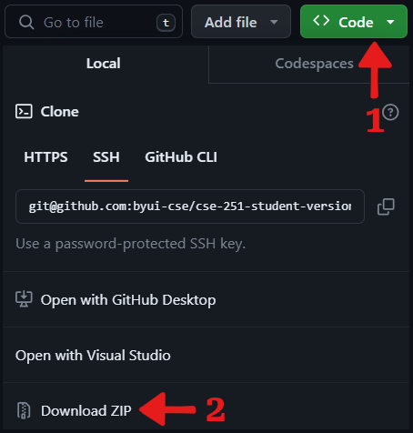

# CSE 351: Concurrency and Parallelism

This repository is intended for students enrolled in the CSE 351 course at Brigham Young University-Idaho (BYU-I). **Please download a personal copy of this repository instead of forking it.** Your use of this repository is subject to the [License Agreement](./LICENSE.md).

If you choose to fork this repository or upload the course content publicly, keep in mind that you DO NOT have the right to publicly post solutions, excluding the solutions BYU-I has purposely intended to be public. You may keep a **private copy** of your code for your own reference.

:copyright: 2022 &ndash; 2024 Brigham Young University Idaho. All Rights Reserved.