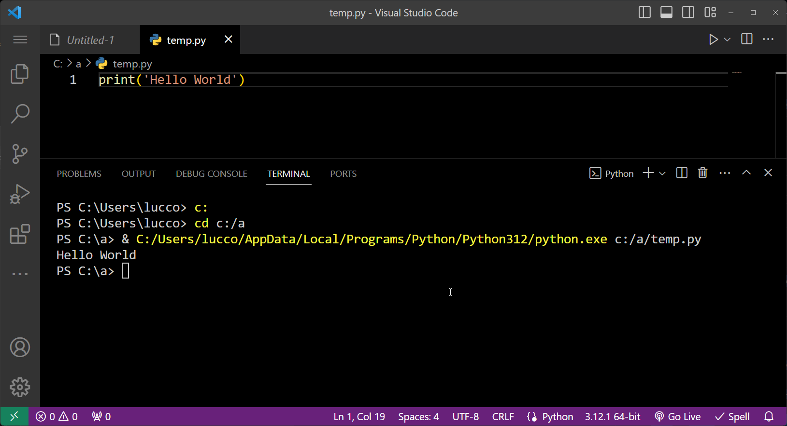
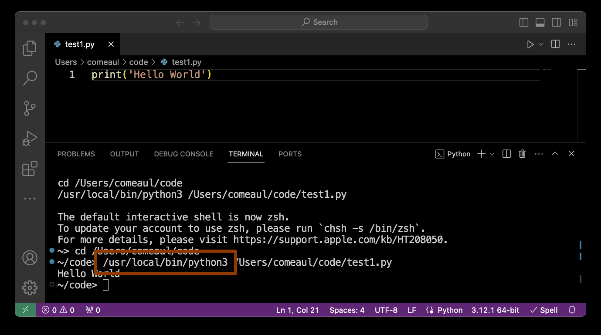

# Course Functions and Objects

To simplify the process of creating your assignments we have created [this Python package](https://github.com/byui-cse/cse351-py-package) that contains common libraries needed for this course. You will need to install this package using `pip` and `git`.

If you are comfortable installing python packages please see the [Quick Install](#quick-install) instructions below. If you run into trouble installing the package you should review the [detailed installation instructions](https://github.com/byui-cse/cse351-py-package?tab=readme-ov-file#installation-instructions). **Keep in mind tht it is very common to have multiple versions of Python on your computer. You must ensure that you install this package with the correct python version for this course.**

### Quick Install

In the following image, a simple program was run in VSCode. (ie., create a simple Python program that prints out "Hello World" and run it.) The terminal window displays the full path of Python in yellow. (ie., `"C:/users/.../python.exe"`). That is the path you must copy and use in the instructions below. The best method to get the path is to run a simple Python program in VSCode and the path will be automatically displayed in the output.



The mac Python path is highlighted below:



You need to have `git` installed on your computer. [Instructions to installing git](https://git-scm.com/book/en/v2/Getting-Started-Installing-Git)

```
Command to run (Mac or Windows):
<python path used in VS Code FROM ABOVE> -m pip install git+https://github.com/byui-cse/cse351-py-package.git
```

### Using the package in your projects

The following code will include the common files for the course. Most of your assignments include this already but if it is ever missing, you can import it into your assignments:

```python
# Include cse351 common Python files
from cse351 import *
```

### Functions

`print_dict(dict, title='')`

This function is used while debugging your programs where it will print a dictionary in a readable format.

### Log Class

A class called Log has be created for the course. It will allow you to create log files while running your programs. Some of these log files will be required for your assignments. It has built in timing methods to help will timing your functions and code. 


Example of creating and using the Log class.

```python
log = Log(show_terminal=True)
log.write('Hello World')
```

When a Log() object is created without a filename, the Log() object will create a file using the current date and time. For example: `1121-120631.log`. The file format is `MMDD-HHMMSS.log`. This log file is created in a sub-folder `logs` that is located in the same folder as your project.

### Plots Class

This class, `Plots`, is used to create simple Matplotlib plots.

Currently, is contains the methods `line_plot` and `bar_plot`.
