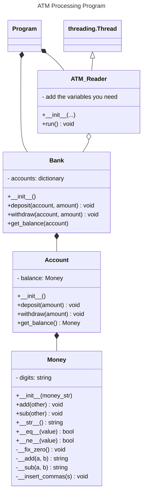
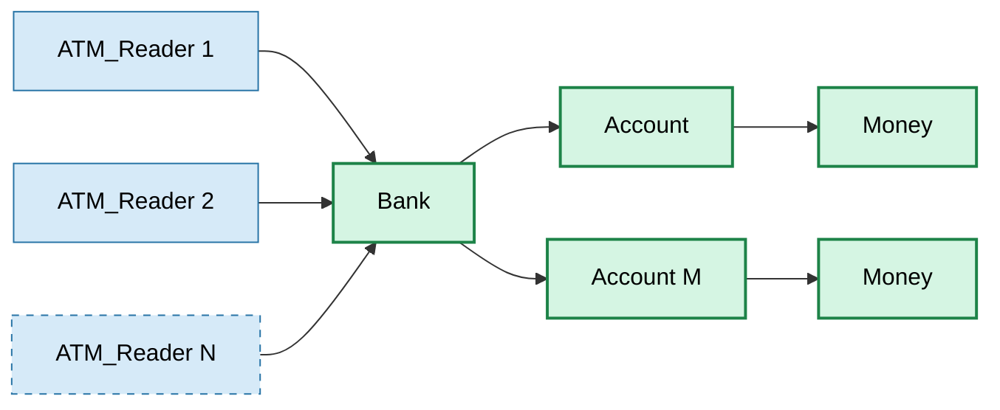

# Assignment 02: Processing ATM transactions

## Overview

There are 10 ATM machines through out the city.  At the end of the day, the bank collects all the transactions from each ATM.  It wants to update the account balances based on those transactions.  To speed up the processing of these transactions, you will be programming threads where each thread will load and process a data file from one ATM machine.

When you run `assignment02.py` for the first time, the program will create the ATM transaction files in the sub folder `data_files`.

## Assignment files

These files are found in the folder `lesson_02/prove` in the Github repository.

- `assignment02.py` program file for your assignment.  This is the file you will be submitting.
- `money.py` Money class to manage money values.

## Requirements

1. Implement the classes for this assignment (See UML Diagram below).
1. Process the ATM data files using threads.  One thread for each data file.  All threads need to be running at the same time.
1. All of the Python packages that you require for this assignment are already imported.  Don't add any other packages.
1. Review Python classes and the code examples in the reading material.
1. Have your program match the account balances.  
1. Run your program multiple times to ensure that you pass all of the tests.
1. No global variables.


## Classes / Files

| Class / File | Purpose |
| --- | --- |
| assignment02.py | This is the assignment Python file |
| Bank | The Bank class is used to hold all of the accounts of the bank |
| Account | The Account class contains the current balance of the account |
| ATM_Reader | Threaded Class that will process one data file and calls methods that the Bank class has for Deposit and With draw |
| Money | This class holds a money value.  The Account class will use it for the balance |

Note: for the classes `Bank`, `Account` and `ATM_Reader`, they are found in the assignment file `assignment02.py`.  Normally, a class should exist in it's own Python file.  For this assignment, we placed all of the classes that you are working on in one file to help with grading.

### UML Diagram

Please use this UML diagram as a starting point for your assignment.  



## Graph of the Classes

There will be a ATM_Reader for each ATM data file.  While reading the data files, there can be any number of accounts found within them.



## ATM Data Files

The format and examples of the data files are as follows:

- `# ...` A line that starts with "#" is a comment, ignore them in your program.

- `5,w,118.92` this is a transaction:  Account number = 5, withdraw, amount = 118.92

- `8,d,126.65` this is a transaction:  Account number = 8, deposit, amount = 126.65

## How to use Money Class

The Money() is used by the Account class to represent money (ie., dollars and cents).  It's constructor takes a money value as a string.

```python
x = Money('123.45')
print(x)

y = Money('3.99')
print(y)

# Add y to x (x changes)
x.add(y)
print(x)

# Subtract y from x (x changes)
x.sub(y)
print(x)
```

## Rubric

The Python file assignment02.py has testing code to verify account balance amounts after all of the ATM data files are processed.  You must match the balances.

Following the grading rubric outlined in the course syllabus.  Note that failing to have threads in this assignment is 50% at best.

## Submission

Assignments are expected to be submitted on time.  Review late policy in the course syllabus.

Assignments are individual and not team based. Any assignments found to be plagiarized will be graded according to the `ACADEMIC HONESTY` section in the syllabus. The Assignment will be graded in broad categories as outlined in the syllabus:

When finished, upload the following Python file in canvas:

- `assignment02.py`

Don't submit `money.py`
