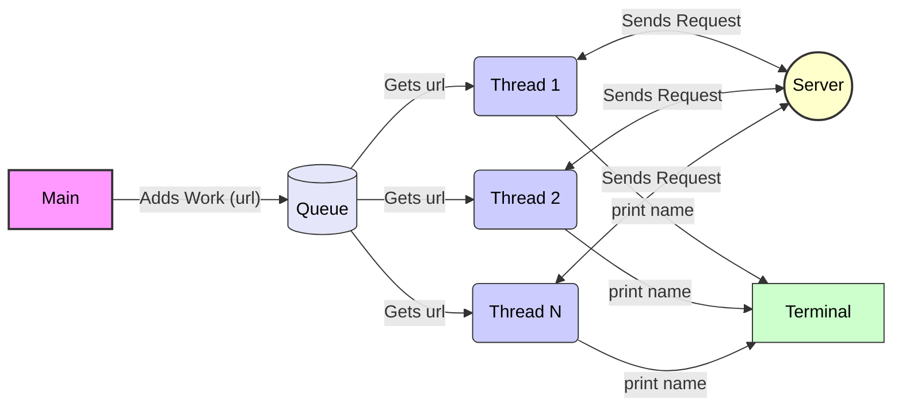

# Lesson 3 Team Teaching: Retrieving data from a local server using a queue

### Overview

This team activity will show you how to use threads to retrieve data from a server.  We will be using a local server, however, this method can be used to retrieve data from a remote server.

### Assignment

This task is to retrieve data from a local server as fast as you can. 

### Files

- **team.py**: This is the team activity program file.  You will be writing your code here.  The current code will connect to the server and retrieve the details of the film 6 of Star Wars.

- **common.py**: This file contains any common variables and functions for this team activity.

- **server.py**: This is the local server program.  In order to run it, you have to open a terminal window to the directory of the team activity and run the program.  ie., `python server.py` or `python3 server.py`.

- **data.json**: This is a data file for the server that contains all of the details of the star wars movies.

**Requirements**

1. Get all of the file downloaded to your computer.  Start the server in a terminal window.  Next, run the existing program and have it display all of the names of film 6's people, planets, species, vehicles and starships.

1. Your goal is to:
    1. Create a threaded function to retrieve one name from the server.
    1. Create a shared queue between the main thread and the threaded function.
    1. The main thread will add urls to the queue and the threaded function will read from the queue to then call the server with that url to retrieve a name.
    1. Try to make your program as fast as possible.  You don't need to have the same output format as the program that is given to you - just display all of the names.

1. To help you learn this material, don't refer to last week's team activity program.

### Sample Solution

When your program is finished, Here is a solution.  Compare them to your approach.

- [Solution](../team/team03_solution.py)

You should work to complete this team activity for the one hour period first, without looking at the sample solution. However, if you have worked on it for at least an hour and are still having problems, you may feel free to use the sample solution to help you finish your program.

### Submission

When complete, please report your progress in the associated Canvas quiz.
