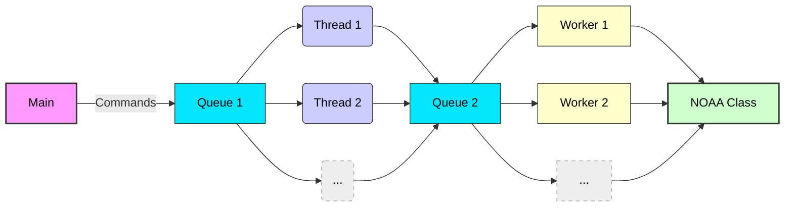

# Assignment 04: Retrieving Weather Data from a Server

## Overview

There are 10 cities that have weather data.  You will be writing a program to retrieve this weather data from a local server.  The goal of this assignment to to use queues to communicate between threads.


## Assignment files

These files are found in the folder `lesson_04/prove` in the Github repository.

- `assignment04.py` program file for your assignment.  This is the file you will be submitting.
- `common.py` Common functions and variables for the assignment
- `server.py` Server program that runs locally on your computer
- `data` This is a folder of weather data

## Requirements

1. Implement the classes for this assignment (See Program Diagram below).
1. You will be required to retrieve weather data as fast as you can from the local server.  Note, that the server will delay each request a small amount of time.  For this assignment, the delay is 0.1 of a second.  
1. Your program needs to retrieve all weather data under 60 seconds.


## Classes / Files

| Class / File | Purpose |
| --- | --- |
| assignment04.py | This is the assignment Python file |
| common.py | Common variables and functions for the assignment |
| server.py | Server program that runs locally on your computer |
| Worker Class | This is a threaded class to process the retrieved weather data |
| NOAA Class | This class will hold all of the weather data based on each city |
| retrieve_weather_data() function | This is a thread function that requests data from the local server |

You will be creating two different types of threads for this assignment.  The threads that connect to the server are threaded functions.  The threads that process the weather data are threaded classes (ie., Worker class).

Note: all classes are found in the assignment file `assignment04.py`.  Normally, a class should exist in it's own Python file.  For this assignment, we placed all of the classes that you are working on in one file to help with grading.

### Program Diagram



### Main

This is the main function of the program.  This is where you will create all of the instances of any classes and the retrieving threads.  You will also create the queues.  Remember that there should not be any global variables in this assignment.  Create what you need in main() and pass it to the threads and classes.

1. The main program first connects with the server to get the number of records for each city.  This code exists in the assignment04.py file.
1. Next, the main function will create a queue and places "commands" in the queue for the threads to use.  These commands should be in the format of tuples like `(city_name, record number)`.  For example, if the program wants the threads to retrieve all of the records for the city of New York, 5,000 commands will be placed in the queue in the format  `("newyork", 0)`, `("newyork", 1)`, ... `("newyork", 4999)`.
1. Your program needs to retrieve all 5,000 records for each city. (ie., main() will be placing 50,000 commands in the queue as there are 10 cities).  Note, use `RECORDS_TO_RETRIEVE` instead of 5000 in your program.

### Local Server

The local server will need to be started before you run your assignment.  Following these steps:

1. Open a terminal/command shell and navigate to the folder where your assignment is located.
1. Run the server with `python server.py`.  Note, you might need to have the full path to Python in order to run the server.  On Mac computers, try `python3 server.py`
1. You can kill the server by pressing `ctrl-c` or closing the terminal/command window.

- Note: the server requires that the sub-folder `data` exists and that it contains the weather data files.
- You can also run the server from VSCode by selecting the option "Run Python program in dedicated terminal".

### Queue (That main uses)

1. This queue if used by main() and the thread functions.  
1. main() will add commands to this queue for the threads to use.
1. Limit the size of the queue to 10 items
1. Note, main() will have to add a "all done" message to the queue to tell the threads when to stop.  Review the reading material for examples.

### Thread Function 

This is a thread where `threading.Thread(target=retrieve_weather_data, args=())` is used to create the thread.  Add any variables as required in the args tuple.

This thread will read commands from the queue and call the server to retrieve weather data for a city.  Then, it will place that information on another queue that the workers threads will use.

### Queue (That the thread function use with the Workers threads)

1. This queue is used between the thread and the workers.  
1. Limit the size of the queue to 10 items.  
1. The information that is required to be sent over the queue is city name, date and temperature.  You can format this as you wish.

### Worker Class

1. This is a threaded class.  
1. You will create `WORKERS` number of workers.
1. When a worker receives information over the queue, it will call a method in the class NOAA to store city name, date and temperature.

### NOAA

1. This class needs to store all of the information of each city.  
1. A city will have a list of date and temperature values.  
1. After all of the data is stored in NOAA, the main function will call NOAA for average temperatures for each city.


## How to call the server

Please review the code found in main() that calls the server for city details.

## Sample output of the assignment

```text
Retrieving city details
           City: Records
===================================
       sandiego: Records = 10,000
   philadelphia: Records = 10,000
    san_antonio: Records = 10,000
       san_jose: Records = 10,000
       new_york: Records = 10,000
        houston: Records = 10,000
         dallas: Records = 10,000
        chicago: Records = 10,000
    los_angeles: Records = 10,000
        phoenix: Records = 10,000
===================================

NOAA Results: Verifying Results
===================================
       sandiego: 14.5004    PASSED
   philadelphia: 14.865     PASSED
    san_antonio: 14.638     PASSED
       san_jose: 14.5756    PASSED
       new_york: 14.6472    PASSED
        houston: 14.591     PASSED
         dallas: 14.835     PASSED
        chicago: 14.6584    PASSED
    los_angeles: 15.2346    PASSED
        phoenix: 12.4404    PASSED
===================================
11:53:05| Run time:  = 38.26219117
```

## Rubric

The Python file assignment04.py has testing code to verify account balance amounts after all of the weather data files are processed.  You must match these values.

Following the grading rubric outlined in the course syllabus.

## Submission

Assignments are expected to be submitted on time.  Review late policy in the course syllabus.

Assignments are individual and not team based. Any assignments found to be plagiarized will be graded according to the `ACADEMIC HONESTY` section in the syllabus. The Assignment will be graded in broad categories as outlined in the syllabus:

When finished, upload the following Python file in canvas:

- `assignment04.py`

Don't submit `common.py` or `server.py`
