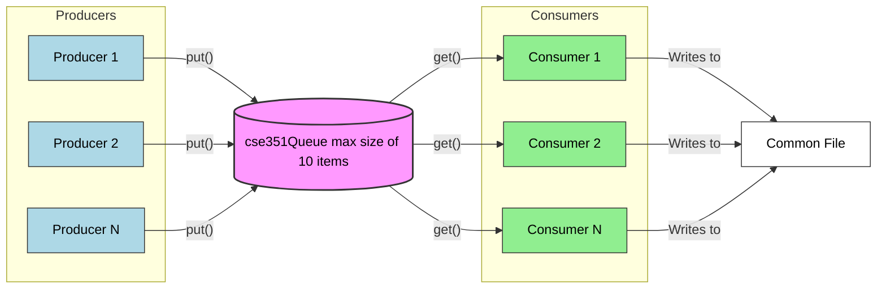

# Lesson 4 Team Teaching: Using Semaphores

### Overview

You will create multiple producers that each create random numbers and adds them to a common queue.  The multiple consumers will takes values from the queue and test if see if the number is a prime.  If it's a prime, it will be appended to a common file.

### Assignment

The main task is to use the cse351Queue class to transfer numbers from the producers to the consumers using semaphores.

### Files

- **team.py**: This is the team activity program file.  You will be writing your code here.

- **primes.txt**: This file that will contain the found primes.  At the start of the program, the file should be cleared of any perviously found numbers.

**Requirements**

- Create the number of producers and consumers as specified in the constants.
- Each producer should generate a random number and place it on the queue.
- Each consumer should get a number from the queue and check if it is prime.
- Each consumer should append to the file output file is a prime is found.
- one producer will send a message ("All Done") to the queue when it is done producing.
- you MUST use the Queue351 class provided in this file.
- Limit the cse351Queue to the max size of 10 items.  (ie., can't place 11th number)
- Do not write polling loops. https://en.wikipedia.org/wiki/Polling_(computer_science)
- No global variables!!!
- Do not use Try Except blocks
- Hint: this program requires 2 semaphores to work correctly.
    - The most important step when using semaphores is to named them correctly.
    - Do not name them Sem1 and Sem2.  Named them based on what they are counting.
    - Semaphores like locks are for data, NOT for threads.
    - Semaphore "signal" threads that something has changed or is available.

Webpage on Semaphores:
https://en.wikipedia.org/wiki/Semaphore_(programming)

    "When used to control access to a pool of resources, a semaphore tracks only how 
     many resources are free. It does not keep track of which of the resources are free."

## Graph of the Threads and Components

### Sample Solution

When your program is finished, Here is a solution.  Compare them to your approach.

- [Solution](../team/team04-solution.py)

You should work to complete this team activity for the one hour period first, without looking at the sample solution. However, if you have worked on it for at least an hour and are still having problems, you may feel free to use the sample solution to help you finish your program.

### Submission

When complete, please report your progress in the associated Canvas quiz.
