# Assignment 06: Processing Images

## Overview

The file folder `faces` contains 13,233 images that require to be processed.  Each image will go through these steps:

1) Smoothed
2) Converted to grayscale
3) Edge detection

The program contained in the file `assignment06.py` process of of these steps for each image.  Your task is to speed up the processing of the images using Python processes from the `multiprocessing` package

## Assignment files

These files are found in the folder `lesson_06/prove` in the Github repository.

- `assignment06.py` program file for your assignment.  This is the file you will be submitting.
- Face images.  [Download the ZIP of images](https://drive.google.com/file/d/1eebhLE51axpLZoU6s_Shtw1QNcXqtyHM/view?usp=sharing).  Extract the images and place thme in a folder named `faces` in the same folder as the `assignment06.py` file.

The following folders will be created when `assignment06.py` is initially run:

- `step1_smoothed`: Smoothed images from `Faces`
- `step2_grayscale`: Converted image to gray scale from `step1_smoothed`
- `step3_edges`: Final images with edge detection from `step2_grayscale`


## Requirements

1. Modify `assignment06.py` to process all images from `faces` to the final image folder `step3_edges`.  You are free to skip folders `step1_smoothed` and `step2_grayscale` if you decide.  You need to end up with the `faces` folder containing the original images and `step3_edges` containing the final images.
1. Follow the program diagram below on how the program needs to be changed.
1. There is no speedup requirement, however, you submitted program needs to be faster that the initial program.  You will submitting the initial run of the program and the finial run as log files.  There log files will show how much faster you got the program to run on your computer.
1. No global variables.  Consts are fine.


## Classes / Files

| Class / File | Purpose |
| --- | --- |
| assignment06.py | This is the assignment Python file.  Modify anything you need to complete the requirements. |
| `faces` | 13,233 face images to be processed (see downlink above) |
| `step1_smoothed` | Smoothed images from `Faces`|
| `step2_grayscale` | Converted image to gray scale from `step1_smoothed` |
| `step3_edges` | Final images with edge detection from `step2_grayscale` |


### Program Diagram

Here is a outline of the final program layout.  You are free to decide on the number of processes for each stage (ie., smoothing, converting to gray scale, edge detection).  Select good values for your computer so that your program runs the fastest.

```mermaid
graph LR
    subgraph Pipeline_Start
        Main["Main Process"]
    end

    subgraph Queue_1
        Q1["Queue1"]
    end

    subgraph Smoothing_Processes
        SG_Entry[ ] --> SP1["Smooth Process 1"]
        SG_Entry[ ] --> SP2["Smooth Process 2"]
        SG_Entry[ ] --> SPN["Smooth Process N"]
        SP1 --> SG_Exit[ ]
        SP2 --> SG_Exit
        SPN --> SG_Exit
    end

    subgraph Queue_2
        Q2["Queue2"]
    end

    subgraph Grayscaling_Processes
        GS_Entry[ ] --> GP1["Grayscale Process 1"]
        GS_Entry[ ] --> GP2["Grayscale Process 2"]
        GS_Entry[ ] --> GPN["Grayscale Process N"]
        GP1 --> GS_Exit[ ]
        GP2 --> GS_Exit
        GPN --> GS_Exit
    end

    subgraph Queue_3
        Q3["Queue3"]
    end

    subgraph Edge_Detection_Processes
        ED_Entry[ ] --> EP1["Edge Detect Process 1"]
        ED_Entry[ ] --> EP2["Edge Detect Process 2"]
        ED_Entry[ ] --> EPN["Edge Detect Process N"]
        EP1 --> ED_Exit[ ]
        EP2 --> ED_Exit
        EPN --> ED_Exit
    end

    Main --> Q1;
    Q1 --> SG_Entry;
    SG_Exit --> Q2;
    Q2 --> GS_Entry;
    GS_Exit --> Q3;
    Q3 --> ED_Entry;
    
    style Main fill:#f0f0f0,stroke:#333,stroke-width:2px,color:#000000
    style Q1 fill:#ffe0b2,stroke:#333,stroke-width:2px,shape:cylinder,color:#000000
    style Q2 fill:#ffe0b2,stroke:#333,stroke-width:2px,shape:cylinder,color:#000000
    style Q3 fill:#ffe0b2,stroke:#333,stroke-width:2px,shape:cylinder,color:#000000

    style SP1 fill:#cce5ff,stroke:#333,stroke-width:1px,color:#000000
    style SP2 fill:#cce5ff,stroke:#333,stroke-width:1px,color:#000000
    style SPN fill:#cce5ff,stroke:#333,stroke-width:1px,color:#000000
    
    style GP1 fill:#d4edda,stroke:#333,stroke-width:1px,color:#000000
    style GP2 fill:#d4edda,stroke:#333,stroke-width:1px,color:#000000
    style GPN fill:#d4edda,stroke:#333,stroke-width:1px,color:#000000

    style EP1 fill:#f8d7da,stroke:#333,stroke-width:1px,color:#000000
    style EP2 fill:#f8d7da,stroke:#333,stroke-width:1px,color:#000000
    style EPN fill:#f8d7da,stroke:#333,stroke-width:1px,color:#000000

    style SG_Entry width:0,height:0,stroke:none,fill:none,color:#000000
    style SG_Exit width:0,height:0,stroke:none,fill:none,color:#000000
    style GS_Entry width:0,height:0,stroke:none,fill:none,color:#000000
    style GS_Exit width:0,height:0,stroke:none,fill:none,color:#000000
    style ED_Entry width:0,height:0,stroke:none,fill:none,color:#000000
    style ED_Exit width:0,height:0,stroke:none,fill:none,color:#000000
```



### Main

Main() will read all of the files in the `faces` folder and add them to `que1`.  Note that you can add lists and tutples to a queue in Python.  A suggestion is to add a pair of values to the queue such as image filename to read and image filename to save to `step3_edges`.  However, there are many methods to do this.  Just remember that the final step must create a edge detected image to `step3_edges` that has the same name as the original image.

### Queues

You decide what will be placed in each queue.

## Sample output of the assignment

There is no sample output, however, the folder `step3_edges` should contain 13,233 images that are edge detected.  Here are a few examples:


## Hints

1. Anything can be placed in a Python queue.
1. You will decide on the number of processes for each stage of processing.  At first, limit each stage with 1 process.
1. Don't forget that an `All done` message must be sent to any processes that are reading from a queue
1. Sometimes, when a queue is finished being used, you can call `que.close()` on it.

## Rubric

Modify the the Python file `assignment06.py` to speed up the process of the images.

Following the grading rubric outlined in the course syllabus.

## Submission

Assignments are expected to be submitted on time.  Review late policy in the course syllabus.

Assignments are individual and not team based. Any assignments found to be plagiarized will be graded according to the `ACADEMIC HONESTY` section in the syllabus. The Assignment will be graded in broad categories as outlined in the syllabus:

When finished, upload the following Python file in canvas:

- `assignment06.py`
- Log file of initial program
- Log file of final program with your changes
- Do not submit any images.

Sample output log file of the initial program:

```
19:44:34| Processing Images
Starting image processing pipeline...
Created folder: step1_smoothed

Processing images from 'faces' to 'step1_smoothed'...
Finished processing. 13233 images processed into 'step1_smoothed'.
Created folder: step2_grayscale

Processing images from 'step1_smoothed' to 'step2_grayscale'...
Finished processing. 13233 images processed into 'step2_grayscale'.

Processing images from 'step2_grayscale' to 'step3_edges'...
Finished processing. 13233 images processed into 'step3_edges'.

Image processing pipeline finished!
Original images are in: 'faces'
Grayscale images are in: 'step1_smoothed'
Smoothed images are in: 'step2_grayscale'
Edge images are in: 'step3_edges'
19:44:49| 
19:44:49| Total Time To complete = 14.93878400
```