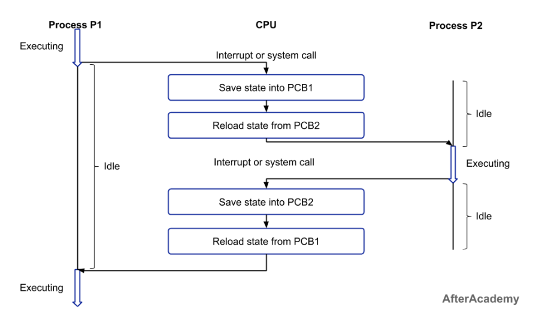

# Lesson 7: Operating System Features and Hardware

**Reading is key to doing well in this course. You will be required to read the provided preparation material each lesson. Take your time and read the material more than once if you don't understand it the first time.**

Section | Content
--- | ---
7.1 | [Process and Thread Scheduling](#process-and-thread-scheduling)
7.2 | [Context Switching](#context-switching) :key:
7.3 | [Memory Management](#memory-management)
7.4 | [Hardware Considerations for Parallelism](#hardware-considerations-for-parallelism)
7.5 | [File Systems](#file-systems)
7.6 | [Recursion](#recursion) :key:

:key: = Vital concepts that we will continue to build on in coming lessons / key learning outcomes for this course.


# Process and Thread Scheduling

Scheduling is a fundamental function of an operating system, responsible for determining which process or thread should be given access to the CPU at any given time. The scheduler aims to achieve several (often conflicting) goals.

1. **Maximizing CPU utilization**: Keeping the CPU busy as much as possible.
1. **Maximizing throughput**: Completing as many processes/threads as possible per unit of time.
1. **Minimizing turnaround time**: The total time taken to complete a process (from submission to completion).
1. **Minimizing waiting time**: The time a process spends waiting in the ready queue.
1. **Minimizing response time**: The time it takes for a process to produce its first response (important for interactive systems).
1. **Fairness**: Ensuring that all processes/threads get a fair share of CPU time.

These goals often require trade-offs. For example, minimizing response time might require frequent context switching, which reduces overall throughput.


## Scheduling Algorithms

Numerous scheduling algorithms have been developed, each with its own strengths and weaknesses. Here are some of the most common algorithms.

### First-Come, First-Served (FCFS) / FIFO:

- **Description**: Processes are executed in the order they arrive. Simple to implement (using a queue).
- **Advantages**: Easy to understand and implement.
- **Disadvantages**: Can lead to long waiting times for short processes if long processes arrive first (the "convoy effect"). Not suitable for interactive systems. Non-preemptive.
- **Example**: Imagine processes A (takes 20 units of time), B (takes 2), and C (takes 3) arriving in that order. A runs to completion first, then B, then C. B and C wait a long time.

### Shortest-Job-First (SJF) / Shortest-Process-Next (SPN):

- **Description**: The process with the shortest estimated next CPU burst time is selected to run next. Can be preemptive or non-preemptive.
- **Advantages**: Minimizes average waiting time (provably optimal in this regard).
- **Disadvantages**: Requires knowing the length of the next CPU burst, which is usually not known in advance. Can lead to starvation of long processes if short processes keep arriving.
- **Example** (Non-preemptive): If A (20), B (2), and C (3) arrive at the same time, B runs first, then C, then A. Much better average waiting time than FCFS.
- **Example** (Preemptive - Shortest Remaining Time First, SRTF): If A (20) is running, and B (2) arrives, A is preempted, B runs to completion, and then A resumes.

### Round Robin (RR):

- **Description**: Each process gets a small unit of CPU time (a "time slice" or "quantum"). After the time slice expires, the process is preempted and moved to the back of the ready queue.
- **Advantages**: Fairness – each process gets a share of the CPU. Good response time for interactive processes.
- **Disadvantages**: Performance depends heavily on the choice of the time slice. Too short a time slice leads to excessive context switching overhead. Too long a time slice approaches FCFS.
- **Example**: Processes A, B, and C each get a time slice of 1. The execution order would be A, B, C, A, B, C, A, B, C... until each process completes.

### Priority Scheduling:

- **Description**: Each process is assigned a priority. The scheduler selects the process with the highest priority to run. Can be preemptive or non-preemptive.
- **Advantages**: Allows important processes to run quickly. Flexible – can be used to implement various scheduling policies.
- **Disadvantages**: Can lead to starvation of low-priority processes. Requires a mechanism for assigning priorities (which can be complex).
- **Example** (Preemptive): If A (priority 3), B (priority 1), and C (priority 2) are ready, A runs first. If C arrives while A is running, A continues (preemptive). If B arrives while A is running, A is preempted and B runs, then A resumes.
- **Aging**: A technique to prevent starvation in priority scheduling. Gradually increase the priority of processes that have been waiting for a long time.

### Multilevel Queue Scheduling:

- **Description**: Partitions the ready queue into multiple queues, each with its own scheduling algorithm. Processes are assigned to a queue based on their characteristics (e.g., interactive vs. batch, I/O-bound vs. CPU-bound).
- **Advantages**: Can tailor scheduling to different types of processes. More flexible than single-queue algorithms.
- **Disadvantages**: More complex to implement. Requires careful design of the queues and their priorities.
- **Example**: A system might have a foreground queue (for interactive processes, using Round Robin) and a background queue (for batch processes, using FCFS).

### Multilevel Feedback Queue Scheduling:

- **Description**: Similar to multilevel queue scheduling, but processes can move between queues. If a process uses too much CPU time, it's moved to a lower-priority queue. If a process waits too long in a lower-priority queue, it might be moved to a higher-priority queue.
- **Advantages**: Adaptive – can adjust to changing process behavior. Combines the benefits of different scheduling algorithms. Good balance between response time and throughput.
- **Disadvantages**: Most complex to implement. Requires careful tuning of parameters (number of queues, scheduling algorithms for each queue, criteria for moving processes between queues).
- **Example**: Three queues: Q0 (RR with quantum 8ms), Q1 (RR with quantum 16ms), Q2 (FCFS). New processes enter Q0. If a process doesn't finish within 8ms, it moves to Q1. If it doesn't finish within 16ms in Q1, it moves to Q2. This favors short bursts and interactive processes.


# Context Switching

Context switching is the process of saving the state of the currently running process (or thread) and restoring the state of another process (or thread), allowing the CPU to switch between them. This is what enables multitasking and concurrency.




Steps for a context switch:

1. Save Context: The OS saves the current state of the running process/thread, including for following:
    - Program Counter (PC)
    - CPU Registers
    - Stack Pointer
    - Process State (running, ready, blocked, etc.)
    - Memory Management Information (page tables, etc.)
1. Select Next Process/Thread: The scheduler chooses the next process/thread to run based on the scheduling algorithm.
1. Restore Context: The OS loads the saved context of the selected process/thread, restoring its PC, registers, etc.
1. Resume Execution: The CPU starts executing the newly loaded process/thread from where it left off.

Context switching has overhead. It takes time to save and restore the process/thread state, and it can also lead to cache misses (as the new process/thread will likely access different memory locations).  Excessive context switching can degrade performance.

## Preemptive vs. Non-Preemptive Multitasking

### Non-Preemptive (Cooperative) Multitasking

- Processes voluntarily give up control of the CPU (e.g., by calling a yield() function or when performing I/O).
- A process can monopolize the CPU if it doesn't yield.
- Simpler to implement (the OS doesn't need to forcibly interrupt processes).
- Less suitable for interactive systems, as a single long-running process can make the system unresponsive.
- Rarely used in modern general-purpose operating systems.

### Preemptive Multitasking

- The operating system can interrupt a running process at any time and switch to another process.
- Uses a timer interrupt to trigger context switches at regular intervals (time slices).
- Provides better responsiveness and fairness.
- More complex to implement (requires careful handling of interrupts and synchronization).
- Used in almost all modern general-purpose operating systems (Windows, macOS, Linux, etc.).


Scheduling algorithms determine which process or thread runs next, context switching is the mechanism for switching between them, and preemption is a policy that allows the OS to forcibly interrupt running processes, ensuring fairness and responsiveness. These concepts are fundamental to understanding how operating systems manage concurrent execution.


# Memory Management

Memory management is a crucial function of an operating system, responsible for efficiently and safely allocating memory to processes and threads.  It involves several key tasks:

*   **Allocation:** Providing memory space to processes and threads when they request it.
*   **Deallocation:** Reclaiming memory space when processes and threads no longer need it.
*   **Protection:** Preventing processes from accessing memory that doesn't belong to them.
*   **Abstraction:** Providing a simplified view of memory to processes (virtual memory).
*   **Sharing:** Allowing certain regions of memory to be shared between processes.

## Virtual Memory

Virtual memory is a fundamental memory management technique that provides several critical benefits.

*   **Abstraction:**  Processes see a *virtual address space*, which is independent of the physical RAM in the machine. Each process has its own virtual address space, typically starting at address 0 and extending to a large maximum value (e.g., 2^63 bytes on a 64-bit system).
*   **Isolation:** Processes are isolated from each other.  A process cannot directly access the memory of another process (unless explicitly allowed through shared memory mechanisms). This enhances security and stability.
*   **Larger Address Space:** The virtual address space can be *larger* than the physical RAM available. This allows programs to run even if they require more memory than is physically present.  The OS uses disk space (a "swap file" or "page file") to store parts of the virtual address space that are not currently in RAM.
*   **Efficient Memory Use:** Only the parts of a process's virtual address space that are actively being used need to be loaded into physical RAM. This allows the system to run more processes concurrently than would be possible if the entire address space of each process had to be loaded.

## Memory Allocation (for Processes and Threads)

**Process Memory Allocation:**

When a process is created, the operating system allocates a virtual address space for it. This typically includes:


*   **Text Segment (Code Segment):** Contains the program's executable code (read-only).
*   **Data Segment:** Contains initialized and uninitialized global and static variables.
*   **Heap:**  Dynamically allocated memory (used by `malloc`, `new`, etc.). The heap grows upwards.
*   **Stack:**  Used for local variables, function parameters, and return addresses.  The stack grows downwards.
*   **Shared Libraries:** Code from shared libraries is mapped into the process address space.

**Thread Memory Allocation:**

Threads within a process share the same address space (heap, data segment, code segment), but each thread has its own:


*   **Stack:**  Each thread has its own stack for local variables, function calls, etc.  The stack size is often limited (e.g., 8MB on Linux). Stack overflow can occur.
*   **Thread-Local Storage (TLS):**  A mechanism to provide each thread with its own private global variables.

Because threads share the heap, dynamic memory allocation (e.g., using `malloc` or `new` in C/C++) needs to be *thread-safe*. The memory allocator must use synchronization mechanisms (like locks) to prevent race conditions when multiple threads try to allocate or deallocate memory concurrently. Python's memory allocator is thread-safe.


# Hardware Considerations for Parallelism

Parallel programming's efficiency and scalability are heavily influenced by the underlying hardware. Understanding hardware architectures is crucial for writing high-performance parallel code. This section explores key hardware aspects relevant to parallelism.

## Multi-core Processors (Architecture, Cache Coherence)

Modern CPUs are almost universally multi-core, meaning they contain multiple independent processing units (cores) on a single chip.  This allows for true parallel execution of multiple processes or threads.

### Architecture
*   **Cores:** Each core is essentially a separate CPU, capable of executing instructions independently.
*   **Shared Cache:** Cores often share some levels of cache memory (L2, L3).  This allows for faster communication and data sharing between cores, but introduces the need for cache coherence.
*   **Private Cache:** Each core typically has its own private L1 cache (and sometimes L2). This provides very fast access to frequently used data.
*   **Interconnect:** The cores are connected by an interconnect (e.g., a bus or a crossbar switch), which allows them to communicate and access shared resources (like main memory).

### Cache Coherence:

A critical issue in multi-core systems is *cache coherence*. Since each core has its own private cache, multiple copies of the same data might exist in different caches.  If one core modifies its cached copy, the other cores' copies become stale (invalid).  Cache coherence protocols ensure that all cores have a consistent view of memory.

*   **Snooping Protocols:**  Each cache monitors (snoops) the memory bus for write operations by other caches.  When a write occurs, other caches either invalidate their copies or update them.  Common protocols include MSI, MESI, MOESI.
*   **Directory-Based Protocols:**  A central directory keeps track of which caches have copies of each memory block.  When a write occurs, the directory is consulted to invalidate or update other caches.  More scalable for systems with many cores.

* **False Sharing**: Occurs when different threads modify different data elements that happen to reside on the same cache line. Even though the threads are not accessing the *same* data, the cache coherence protocol treats the entire cache line as a unit. This can significantly degrade performance as cache lines are constantly invalidated and updated.

```c
// Example (Conceptual - C/C++)
int data[2];  // Assume these are on the same cache line
// Thread 1:
data[0] = 1;
// Thread 2:
data[1] = 2;
```
Even though thread 1 is modifying data[0] and thread 2 is modifying data[1], they both end up with the same cache line. So the cache coherency protocol makes sure that only one is able to operate.

## Hyperthreading (Simultaneous Multithreading - SMT)

Hyperthreading (Intel's term; also known as Simultaneous Multithreading or SMT) is a technique that allows a *single* physical core to appear as multiple logical cores to the operating system.

### How it Works

The core duplicates certain parts of its architecture (e.g., registers, instruction queues), but shares other resources (e.g., execution units, caches).  This allows the core to switch between threads very quickly (often on every clock cycle), hiding latency (e.g., waiting for memory access).

### Benefits

Improves CPU utilization, especially when threads are frequently blocked (e.g., waiting for I/O). Can provide a performance boost, but it's *not* the same as having truly independent cores.

### Limitations

The performance gain is typically less than having additional physical cores.  Threads still share resources, so they can contend for those resources.

## NUMA (Non-Uniform Memory Access) Architectures

In Non-Uniform Memory Access (NUMA) systems, the time it takes for a processor to access memory depends on the location of the memory relative to the processor.

### Concept

The system is divided into *nodes*. Each node contains one or more processors and a portion of the system's RAM.  Processors have fast access to their *local* memory (within the same node) and slower access to *remote* memory (in other nodes).

### Impact on Parallelism

It's crucial to be aware of NUMA when writing parallel code.  Data locality becomes very important.  You want to place data in the memory that's local to the processor that will be accessing it most frequently.  Otherwise, performance can suffer due to the increased latency of remote memory access.

### Operating System Support

Modern operating systems are NUMA-aware and try to allocate memory for a process on the same node as the processor running the process.  However, for optimal performance, you may need to explicitly manage memory placement in your code (e.g., using libraries like `numactl` on Linux).

## GPUs (Graphics Processing Units) and their Role in Parallelism (Brief Overview)

GPUs are specialized processors originally designed for graphics rendering, but they have become increasingly important for general-purpose parallel computing.

- **Architecture:** GPUs have a massively parallel architecture, with thousands of small cores designed for highly parallel tasks.
- **SIMD (Single Instruction, Multiple Data):** GPUs excel at performing the same operation on many data elements simultaneously (SIMD).
- **Programming Models:**  Specialized programming models like CUDA (NVIDIA) and OpenCL are used to write code for GPUs.
- **Use Cases:**  Machine learning, scientific computing, data analysis, image/video processing, cryptography.

## Clusters and Distributed Systems (Brief Overview)

For very large-scale parallelism, clusters and distributed systems are used.

- **Cluster:** A collection of interconnected computers (nodes) that work together as a single system.  Nodes typically communicate over a high-speed network.
- **Distributed System:**  A more general term for a system where components located on networked computers communicate and coordinate their actions by passing messages.
- **Message Passing:**  The primary communication mechanism in distributed systems is message passing (e.g., using MPI - Message Passing Interface).
- **Challenges:**  Fault tolerance, data consistency, network latency, and distributed consensus become major challenges in distributed systems.

This section provides a high-level overview of hardware considerations that are crucial for understanding and optimizing parallel programs. From the intricacies of multi-core processors and cache coherence to the massively parallel architecture of GPUs and the distributed nature of clusters, the hardware landscape significantly impacts the design and performance of parallel applications.


# File Systems

The file system plays a significant, and often overlooked, role in the performance and correctness of parallel programs.  Here's a breakdown of how the file system affects parallelism.

## I/O Bottleneck and Parallel Performance:

### Sequential Access Limitation

Traditional hard disk drives (HDDs) are inherently sequential access devices. While they can handle multiple requests concurrently, true parallelism is limited by the physical movement of the read/write head. This is a major bottleneck. If multiple threads/processes are all trying to read or write to different locations on the same HDD, performance degrades significantly due to "seek time" (the time it takes for the head to move). The OS's I/O scheduler tries to optimize this, but there are limits.

### Solid State Drives (SSDs)

SSDs, with their lack of moving parts, significantly mitigate this issue. They have much lower latency and can handle concurrent requests with far less performance degradation. However, even SSDs have limits on their bandwidth and the number of simultaneous operations they can efficiently handle. Different SSD technologies (SATA, NVMe) have different performance characteristics.

### File System Caching

Operating systems use file system caches (often called the "buffer cache" or "page cache") to keep frequently accessed data in RAM. This dramatically speeds up reads, if the data is already in the cache. However, cache coherency becomes a concern in parallel scenarios.

### Write-Back

Changes are written to the cache, and only periodically flushed to disk. This improves performance but introduces a risk of data loss if there's a power failure. In parallel programs, if one thread writes to the cache and another tries to read from it before the data is flushed to disk, the second thread might read stale data.

### Write-Through

Changes are immediately written to both the cache and the disk. This is safer but slower.

### Buffering

Even without caching, the OS and file system drivers often use buffers to group small writes together into larger, more efficient disk operations. This buffering can affect the order in which writes from different threads/processes actually reach the disk.


## File Locking and Synchronization:

### Data Races and Inconsistency

If multiple threads/processes access the same file concurrently without proper synchronization, data corruption can occur. This is a classic race condition. For example, two processes might try to append to the same log file simultaneously, resulting in interleaved (and corrupted) log entries.
File Locking Mechanisms: Operating systems provide file locking mechanisms to prevent these issues.

### Advisory Locking

A cooperative locking mechanism. Processes agree to check for locks before accessing the file. This relies on all processes behaving correctly. If one process ignores the lock, it can still cause problems.

### Mandatory Locking

The operating system enforces the lock. Attempts to access a locked file without acquiring the lock will result in an error or blocking. This is more robust but can be less portable.

**Lock Granularity**

- Whole-File Locking: Simple, but can be a significant performance bottleneck if only a small portion of the file needs to be accessed.
- Byte-Range Locking: Allows locking specific regions of a file, enabling finer-grained concurrency. This is more complex to manage but can significantly improve performance in many cases.
- Deadlocks: Just like with threads and processes, improper use of file locks can lead to deadlocks. For example, process A might lock file X and then try to lock file Y, while process B locks file Y and then tries to lock file X.


## File System Metadata Operations

### Metadata Operations

Operations like creating files, deleting files, renaming files, and changing permissions involve modifying file system metadata (inodes, directory entries, etc.). These operations are typically handled by the file system kernel code and often require exclusive access to certain data structures.

### Contention

If many threads/processes are concurrently creating/deleting files in the same directory, they may contend for access to the directory's metadata, creating a bottleneck. This is less of an issue with modern, journaled file systems, but it can still occur.

### Directory Structure

The organization of files and directories can impact parallelism. Having many small files in a single directory can lead to more metadata contention than having files spread across multiple directories.


## Network File Systems (NFS, SMB/CIFS)

### Network Latency

When dealing with network file systems, network latency and bandwidth become major factors. Parallel operations that involve frequent access to files over a slow network will be severely limited.

### Caching and Consistency

Network file systems often employ complex caching mechanisms to improve performance. Maintaining cache coherency across multiple clients accessing the same files concurrently is a challenging problem. Different protocols (NFS, SMB) have different approaches to this, with varying trade-offs between performance and consistency.

### Locking over the Network

File locking becomes even more complex in a distributed environment. The locking mechanism must be implemented across the network, and network failures can introduce additional complications.


## File System Type and Features:

### Journaling

Modern file systems (like ext4, NTFS, APFS) typically use journaling. This means that changes to the file system are first written to a journal (a log) before being applied to the main file system. This improves data integrity and recovery in case of crashes, but it can also introduce some overhead.

### Copy-on-Write (COW)

Some file systems (like Btrfs, ZFS) use copy-on-write. When a file is modified, the changed blocks are written to a new location on disk, and then the metadata is updated to point to the new blocks. This can improve data integrity and enable features like snapshots, but it can also affect performance in some parallel workloads.

### RAID

RAID configurations, which combine multiple physical disks into a single logical unit, can have a significant effect. RAID level affects parallelization.

### Distributed File Systems

Systems like HDFS and Ceph are designed for parallelism and distributed data storage. They handle data replication, fault tolerance, and parallel access across multiple nodes.

## Practical Implications for Parallel Programming:

### Minimize File I/O

If possible, design your parallel program to minimize file I/O during the computationally intensive parts. Load data into memory before starting parallel processing, and write results only when necessary.

### Use SSDs

Use SSDs whenever possible, especially for temporary files and data that will be accessed frequently by multiple threads/processes.

### Consider File Locking

If multiple threads/processes need to modify the same file, use appropriate file locking mechanisms to prevent data corruption. Choose the appropriate lock granularity (whole-file vs. byte-range).

### Optimize Directory Structure

Avoid having too many files in a single directory, especially if those files will be created/deleted concurrently.

### Network File System Awareness

Be aware of the limitations and performance characteristics of network file systems if your program will be running in a distributed environment.

### Asynchronous I/O

Use asynchronous I/O operations (if available) to allow your program to continue processing while waiting for I/O operations to complete. This can improve responsiveness and overlap I/O with computation.

### Memory-Mapped Files

Memory-mapped files (using mmap in POSIX systems or equivalent APIs in other OSes) can provide a way to access file data as if it were in memory, potentially simplifying parallel access and reducing the need for explicit I/O operations. However, careful synchronization is still required.

# Recursion

We will be using recursion for the next assignment.

> In computer science, recursion is a method of solving a problem where the solution depends on solutions to smaller instances of the same problem. Such problems can generally be solved by iteration, but this needs to identify and index the smaller instances at programming time. Recursion solves such recursive problems by using functions that call themselves from within their own code. The approach can be applied to many types of problems, and recursion is one of the central ideas of computer science.


(Image from [Skilled.dev Recursion Course](https://skilled.dev/course/recursion))

Please keep in mind that recursion by itself will not inherently introduce cache coherence issues, but the way you implement recursion in your programs and how data is accessed within a recursive function can potentially impact cache performance greatly.

Please familiarize yourself with the concept of recursion and how it *looks* on the system. The image above for example shows recursion in action, and the image below shows the state of the call stack for this recursion.


(Image from Code Academy [CSJS 22 Recursion Cheatsheet](https://www.codecademy.com/learn/cscj-22-basic-algorithms/modules/cscj-22-recursion/cheatsheet))

## Recursion Resources

If you need help understanding recursion or need to refresh your memory on how it works, please review these links:

- [Recursion (computer science)](https://en.wikipedia.org/wiki/Recursion_\(computer_science\))
- [Recursion in Python](https://realpython.com/python-thinking-recursively/#recursive-functions-in-python)
- [Understanding Recursion](https://stackabuse.com/understanding-recursive-functions-with-python/)
- [Video on Recursion](https://www.youtube.com/watch?v=ngCos392W4w)
- [What on Earth is Recursion? - Computerphile](https://www.youtube.com/watch?v=Mv9NEXX1VHc)