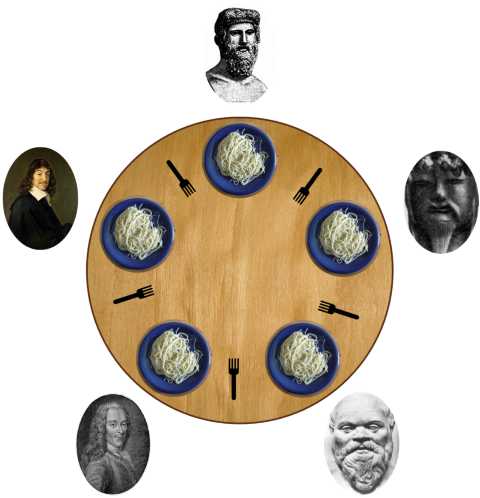

# Team 7 Team: Dining Philosophers Problem

### Overview

We will be using the famous Dining Philosophers problem to practice skills we have learned so far in this course.

### Problem Statement

Five silent philosophers sit at a round table with bowls of spaghetti. Forks are placed between each pair of adjacent philosophers.

Each philosopher must alternately think and eat. However, a philosopher can only eat spaghetti when they have both left and right forks. Each fork can be held by only one philosopher and so a philosopher can use the fork only if it is not being used by another philosopher. After an individual philosopher finishes eating, they need to put down both forks so that the forks become available to others. A philosopher can only take the fork on their right or the one on their left as they become available and they cannot start eating before getting both forks.

Eating is not limited by the remaining amounts of spaghetti or stomach space; an infinite supply and an infinite demand are assumed.

The problem is how to design a discipline of behavior (a concurrent algorithm) such that no philosopher will starve; i.e., each can forever continue to alternate between eating and thinking, assuming that no philosopher can know when others may want to eat or think.

### Assignment

Refer to the header of the Python files for the complete requirements for this team activity:

Solve this problem with the skills you have learned so far in this course. You will be required to use threading for your solution.

### Sample Solutions

We will go over the solution in the last class of this week.

### Submission

When complete, please report your progress in the associated Canvas quiz. If you decided to do additional work on the program after your team activity, either by yourself or with others, feel free to include that additional work when you report on your progress in Canvas.
