# Lesson 9: Classic Concurrency Problems

**Reading is key to doing well in this course. You will be required to read the provided preparation material each lesson. Take your time and read the material more than once if you don't understand it the first time.**

Section | Content
--- | ---
9.1 | [Patterns](#Patterns)
9.2 | [The Producer-Consumer Problem](#The-Producer-Consumer-Problem)
9.3 | [The Readers-Writers Problem](#The-Readers-Writers-Problem)
9.4 | [The Dining Philosophers Problem](#The-Dining-Philosophers-Problem)
9.5 | [Monte Carlo Simulations](#Monte-Carlo-Simulations)
9.6 | [Other Classic Problems](#Other-Classic-Problems)

:key: = Vital concepts that we will continue to build on in coming lessons / key learning outcomes for this course.


# Common Programming Patterns

## Boss-Worker Pattern

The Boss-Worker pattern involves a "boss" thread that distributes tasks to multiple "worker" threads. The boss thread is responsible for task creation and distribution, while worker threads perform the actual work.  This pattern is useful for parallelizing tasks that can be divided into independent subtasks.

#### Boss

- Creates and manages worker threads.
- Divides the workload into smaller tasks.
- Distributes tasks to available workers.
- May collect and aggregate results from workers.


#### Workers

- Receive tasks from the boss.
- Execute the tasks independently.
- May return results to the boss.


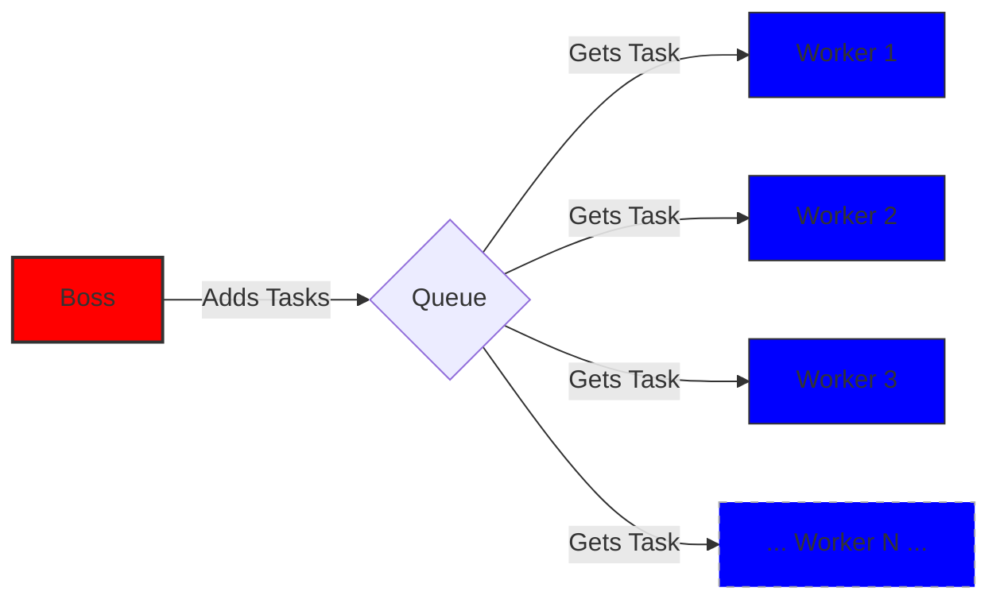

### Code Example

```python
```

## Producer-Consumer Pattern

The Producer-Consumer pattern involves one or more "producer" threads that generate data and one or more "consumer" threads that process that data.
A shared buffer is used to hold the data between producers and consumers.
This pattern is useful for decoupling data generation from data processing.

#### Producers
- Generate data.
- Place data into the shared buffer.
- Signal consumers when data is available.


#### Consumers
- Retrieve data from the shared buffer.
- Process the data.
- Signal producers when buffer space is available.


### Code Example

```python
```

## Bounded Buffer

A Bounded Buffer is a variation of the Producer-Consumer pattern where the shared buffer has a fixed size.  Producers wait if the buffer is full, and consumers wait if the buffer is empty.  This pattern is used to control the rate of data production and consumption.

#### Details
- Implements a fixed-size buffer.
- Uses synchronization mechanisms (e.g., 2 semaphores) to manage buffer access.  Each semaphore handles the "ends" of the buffer.  One for index == 0 and one for index == (N-1)
- Producers block when the buffer is full.
- Consumers block when the buffer is empty.

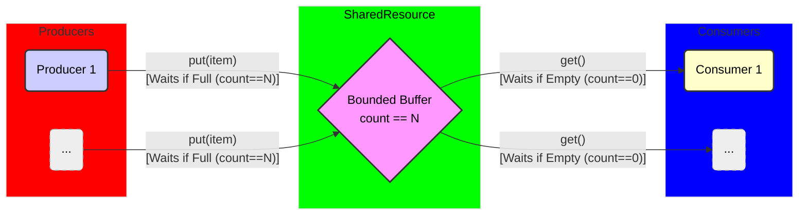

### Code Example

```python
```

## Client-Server Pattern

The Client-Server pattern involves a "server" that provides services to multiple "clients."  Clients send requests to the server, and the server processes the requests and sends responses back to the clients.  This pattern is fundamental to network applications.

#### Server
- Listens for client connections.
- Accepts client requests.
- Processes requests concurrently (using threads or tasks).
- Sends responses to clients.


#### Clients
- Connect to the server.
- Send requests to the server.
- Receive responses from the server.

TODO - Add image


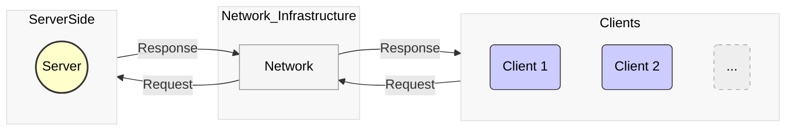

### Code Example

```python
```

## Reader-Writer Problem

The Reader-Writer problem involves managing concurrent access to a shared resource, where multiple readers can access the resource simultaneously, but writers require exclusive access.  The challenge is to allow concurrent reads while preventing data corruption when a writer modifies the resource.

#### Readers

Can access the resource concurrently as long as no writer is active.

#### Writers

Need exclusive access to modify the resource.

#### Potential Issues
- Starvation: Writers may be starved if there is a continuous stream of readers.
- Deadlocks: If readers and writers acquire locks in different orders, deadlocks can occur.

TODO - Add image

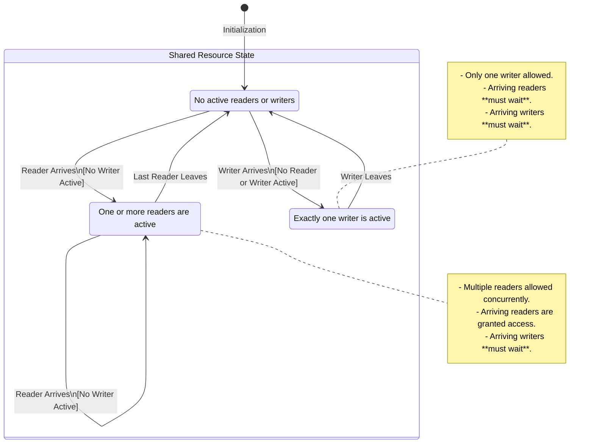

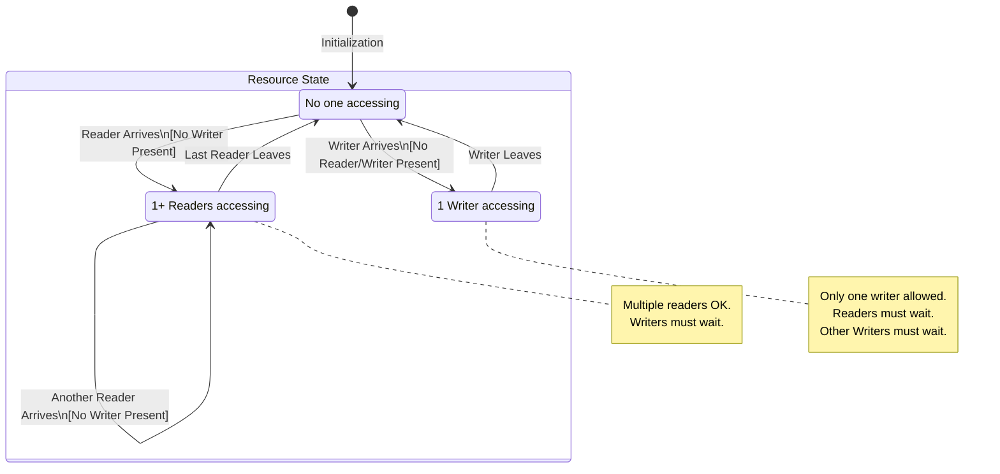

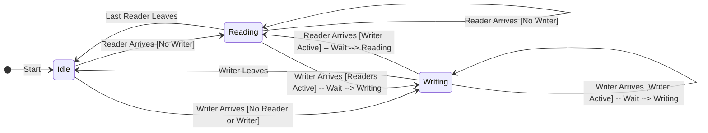

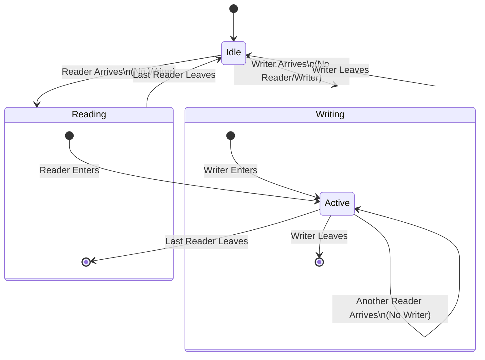

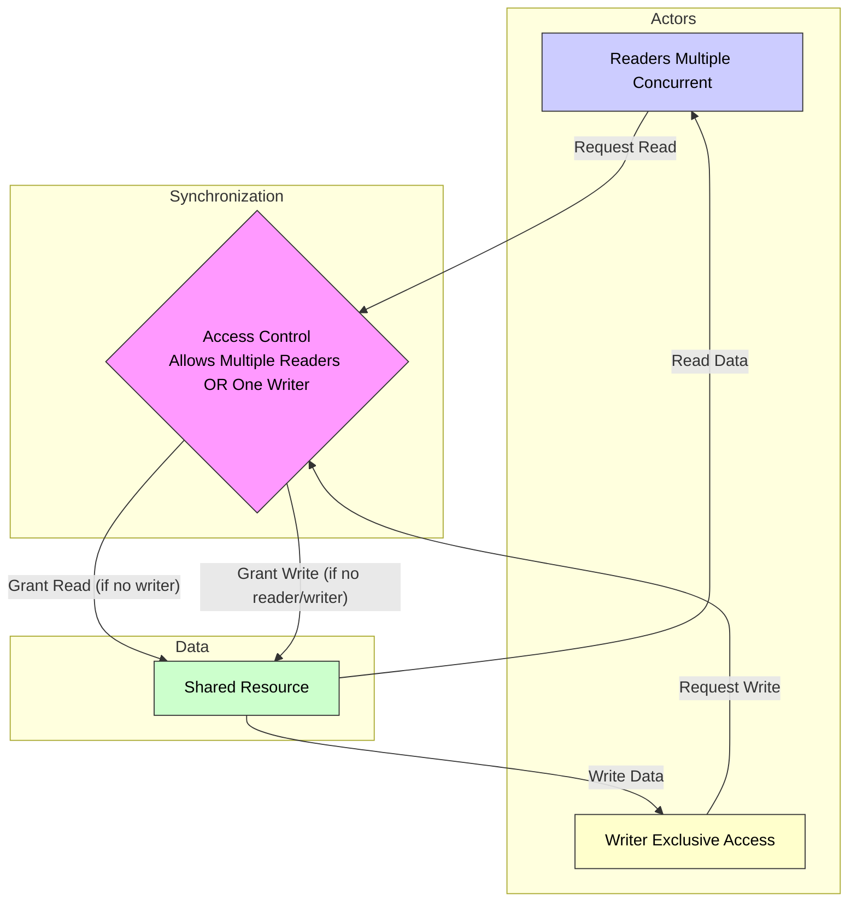

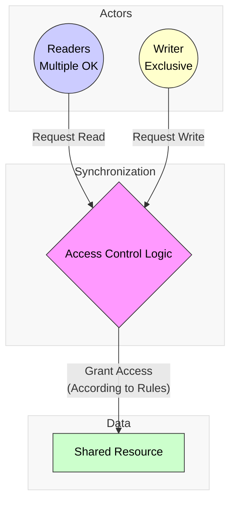

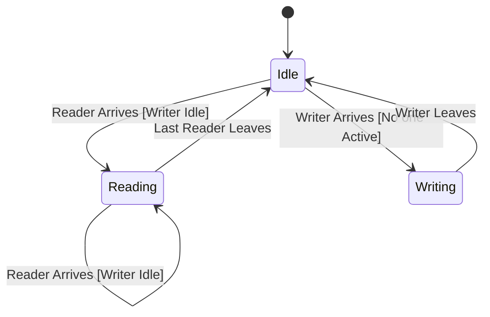

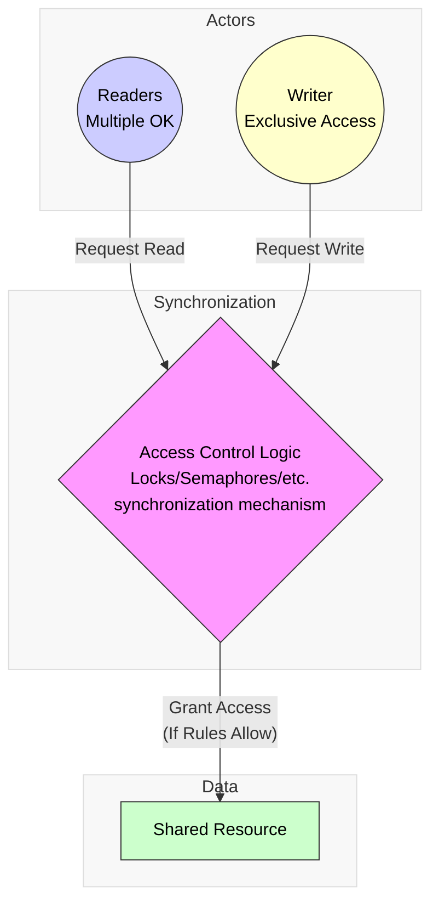

```mermaid
```


### Code Example

```python
```

## Dining Philosophers Problem

The Dining Philosophers problem illustrates a classic synchronization issue where multiple philosophers sit around a table with a single chopstick between each pair.  Each philosopher needs two chopsticks to eat, but they can only pick up one chopstick at a time.  The challenge is to prevent deadlocks where each philosopher holds one chopstick and waits indefinitely for the other.


#### Philosophers

Need two chopsticks (resources) to eat.

#### Chopsticks

Shared resources that can only be used by one philosopher at a time.

#### Potential Issue

- Deadlock if all philosophers pick up their left chopstick simultaneously.

TODO - Add image

### Code Example

```python
```

## Sleeping Barber Problem

The Sleeping Barber problem models a barber shop with a single barber and a limited number of waiting chairs.  The barber sleeps when there are no customers, and customers leave if there are no available chairs.  The challenge is to ensure that the barber and customers coordinate properly to avoid race conditions and deadlocks.


#### Barber

Sleeps when there are no customers, wakes up when a customer arrives.
#### Customers

Enter the shop if there is an available chair, otherwise leave.
#### Waiting Chairs

Limited number of chairs for waiting customers.

#### Potential Issues
- Race Condition: Multiple customers might try to wake up the barber simultaneously.
- Deadlock: The barber might be waiting for a customer while a customer is waiting for the barber.

TODO - Add image

### Code Example

```python
```

## Elevator Simulation

Simulate the behavior of an elevator system with multiple elevators, floors, and passengers.  The simulation should handle passenger requests, elevator movement, and floor selection.  This problem demonstrates concurrent process interactions and resource management.

#### Elevators

Move between floors, have capacity limits, and door open/close mechanisms.

#### Floors

Passengers request elevators from floors, and elevators arrive at floors.

#### Passengers

Generate requests with source and destination floors.

#### Challenges
- Coordinating elevator movement to minimize waiting time and travel distance.
- Handling concurrent passenger requests efficiently.
- Avoiding collisions and deadlocks.

TODO - Add image

### Code Example

```python
```


## Cigarette Smokers Problem

The Cigarette Smokers problem is a classic concurrency problem that illustrates synchronization challenges.  Three smokers have different resources (tobacco, paper, matches), and an agent provides two of the three resources at a time.  Each smoker needs all three resources to make a cigarette, but they can only acquire the resources provided by the agent.  The challenge is to synchronize the smokers and the agent to avoid deadlocks and ensure progress.


#### Smokers

Each smoker has one of the three resources and needs the other two.

#### Agent

Randomly provides two of the three resources.

#### Challenges

- Ensuring that only one smoker can acquire the necessary resources at a time.
- Preventing deadlocks where smokers wait indefinitely for the missing resource.

TODO - Add image

### Code Example

```python

```

## Monte Carlo Simulations

Monte Carlo simulations use random sampling to estimate numerical results.  These simulations are often used in finance, physics, and engineering.  Parallelizing Monte Carlo simulations can significantly improve performance.

#### Random Number Generation

Generate a large number of random samples.

#### Computation

Perform calculations on each sample.

#### Aggregation

Aggregate the results from all samples.

#### Challenges
- Ensuring that random number generation is thread-safe.
- Efficiently distributing the workload across multiple threads or tasks.

TODO - Add image

### Code Example

```python
```
