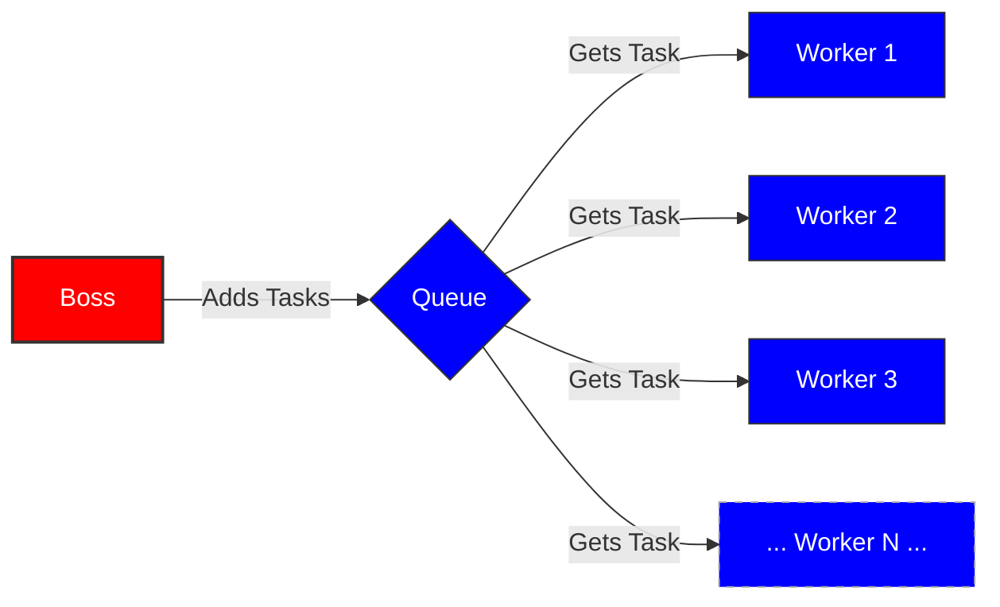
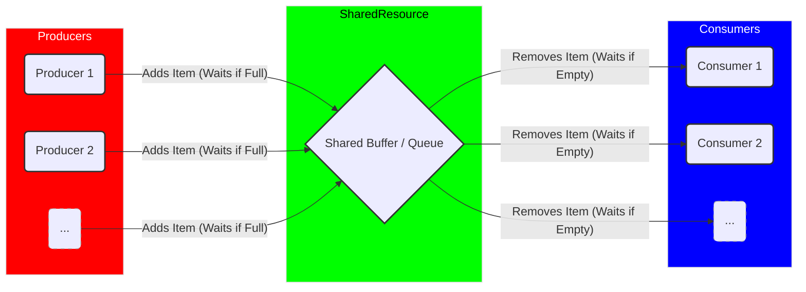
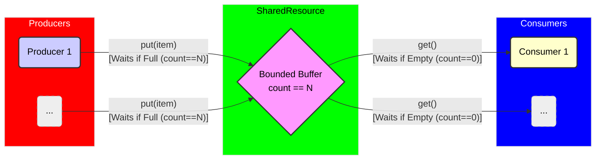
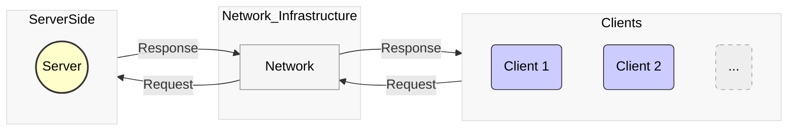
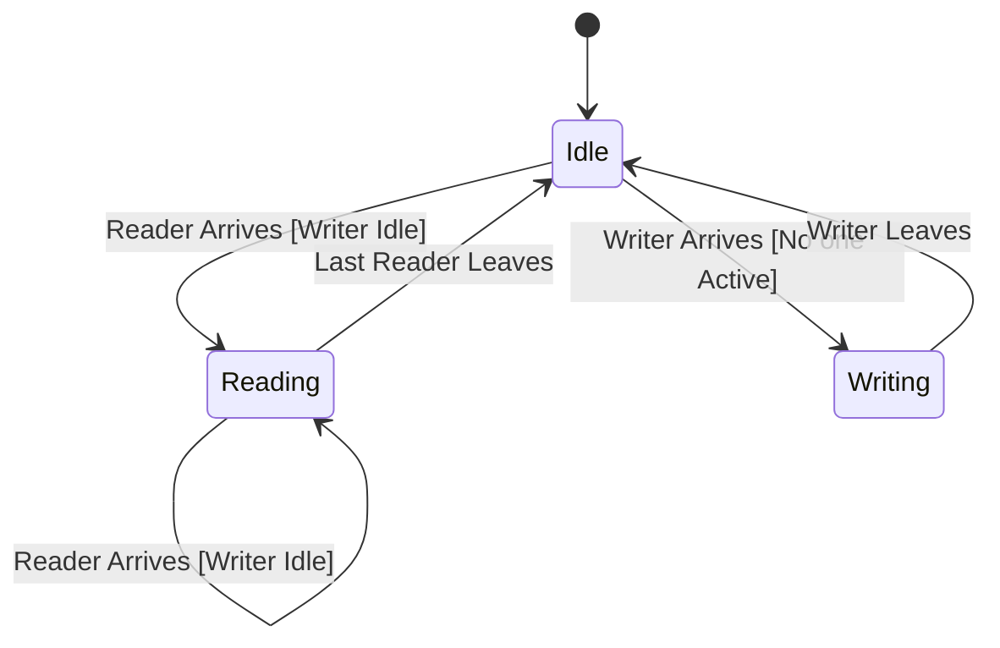

# Lesson 9: Classic Concurrency Problems

**Reading is key to doing well in this course. You will be required to read the provided preparation material each lesson. Take your time and read the material more than once if you don't understand it the first time.**

Section | Content
--- | ---
9.1 | [Boss-Worker Pattern](#boss-worker-pattern)
9.2 | [Producer-Consumer Pattern](#producer-consumer-pattern)
9.3 | [Bounded Buffer](#bounded-buffer)
9.4 | [Client-Server Pattern](#client-server-pattern)
9.5 | [Reader-Writer Problem](#reader-writer-problem)
9.6 | [Dining Philosophers Problem](#dining-philosophers-problem)
9.7 | [Sleeping Barber Problem](#sleeping-barber-problem)
9.8 | [Elevator Simulation](#elevator-simulation)
9.9 | [Cigarette Smokers Problem](#cigarette-smokers-problem)
9.10 | [Monte Carlo Simulations](#monte-carlo-simulations)

:key: = Vital concepts that we will continue to build on in coming lessons / key learning outcomes for this course.


# Boss-Worker Pattern

The Boss-Worker pattern involves a "boss" thread that distributes tasks to multiple "worker" threads. The boss thread is responsible for task creation and distribution, while worker threads perform the actual work.  This pattern is useful for parallelizing tasks that can be divided into independent subtasks.

## Boss

- Creates and manages worker threads.
- Divides the workload into smaller tasks.
- Distributes tasks to available workers.
- May collect and aggregate results from workers.


## Workers

- Receive tasks from the boss.
- Execute the tasks independently.
- May return results to the boss.




## Code Example

This example creates workers and a queue.  The main function add tasks to the queue for the workers.  The workers work until they see an "All Done" message/value.

```python
import random
import threading
import queue
import time

def simple_worker(task_queue, worker_id):
    thread_name = threading.current_thread().name
    print(f"{thread_name} (Worker {worker_id}): Ready.")
    while True:
        task_description = task_queue.get()

        if task_description is None:
            print(f"{thread_name} (Worker {worker_id}): Stop signal received, exiting.")
            break

        print(f"{thread_name} (Worker {worker_id}): Processing '{task_description}'...")
        time.sleep(random.uniform(0.5, 1.0)) # Simulate work
        print(f"{thread_name} (Worker {worker_id}): Finished '{task_description}'.")

        task_queue.task_done()

if __name__ == "__main__":
    NUM_WORKERS = 2
    NUM_TASKS = 5

    task_queue = queue.Queue()

    print(f"BOSS: Starting {NUM_WORKERS} workers...")
    worker_threads = []
    for i in range(NUM_WORKERS):
        worker_id = i + 1
        thread = threading.Thread(target=simple_worker, args=(task_queue, worker_id), name=f"Worker-{worker_id}")
        thread.start()
        worker_threads.append(thread)

    print(f"BOSS: Adding {NUM_TASKS} tasks to the queue...")
    for i in range(NUM_TASKS):
        task_queue.put(f"Task-{i+1}")

    print("BOSS: Sending stop signals to workers...")
    for _ in range(NUM_WORKERS):
        task_queue.put(None)

    print("BOSS: Waiting for worker threads to exit...")
    for thread in worker_threads:
        thread.join()

    print("BOSS: All workers have finished. Program complete.")
```


# Producer-Consumer Pattern

The Producer-Consumer pattern involves one or more "producer" threads that generate data and one or more "consumer" threads that process that data.
A shared buffer is used to hold the data between producers and consumers.
This pattern is useful for decoupling data generation from data processing.

## Producers
- Generate data.
- Place data into the shared buffer.
- Signal consumers when data is available.


## Consumers
- Retrieve data from the shared buffer.
- Process the data.
- Signal producers when buffer space is available.



## Code Example

This example of producer-consumer pattern creates two threads and a queue to go between them.  The producer add items to the queue for the consumer.  When the producer is finished, it adds a "All Done" message/value to the queue.

```python
import threading
import queue
import time
import random

def producer(q, num_items):
    producer_id = threading.current_thread().name
    print(f"{producer_id}: Starting to produce {num_items} items...")
    for i in range(num_items):
        item = f"Data Packet {i+1}"
        time.sleep(random.uniform(0.1, 0.5))
        q.put(item)
        print(f"{producer_id}: Produced '{item}'. Queue size approx: {q.qsize()}")
    q.put(None)
    print(f"{producer_id}: Finished producing. Sent stop signal.")

def consumer(q):
    consumer_id = threading.current_thread().name
    print(f"{consumer_id}: Starting to consume...")
    while True:
        item = q.get()
        if item is None:
            print(f"{consumer_id}: Received stop signal. Exiting.")
            break
        print(f"{consumer_id}: Consuming '{item}'...")
        time.sleep(random.uniform(0.2, 1.0))
        print(f"{consumer_id}: Finished consuming '{item}'.")
    print(f"{consumer_id}: Exiting.")

if __name__ == "__main__":
    NUMBER_OF_ITEMS = 5

    shared_queue = queue.Queue()

    print("Main: Setting up Producer and Consumer threads.")
    producer_thread = threading.Thread(target=producer, args=(shared_queue, NUMBER_OF_ITEMS), name="Producer")
    consumer_thread = threading.Thread(target=consumer, args=(shared_queue,), name="Consumer")

    print("Main: Starting threads...")
    producer_thread.start()
    consumer_thread.start()

    print("Main: Waiting for threads to finish...")
    producer_thread.join()

    print("Main: Producer thread has finished.")
    consumer_thread.join()

    print("Main: Program complete.")
```


# Bounded Buffer

A Bounded Buffer is a variation of the Producer-Consumer pattern where the shared buffer has a fixed size.  Producers wait if the buffer is full, and consumers wait if the buffer is empty.  This pattern is used to control the rate of data production and consumption.

## Details
- Implements a fixed-size buffer.
- Uses synchronization mechanisms (e.g., 2 semaphores) to manage buffer access.  Each semaphore handles the "ends" of the buffer.  One for index == 0 and one for index == (N-1)
- Producers block when the buffer is full.
- Consumers block when the buffer is empty.



## Code Example

Bounded Buffer pattern is very close to the producer-consumer pattern except here, we limit the size of the queue using the options `maxsize=`.

```python
import threading
import queue
import time
import random

BUFFER_SIZE = 3
ITEMS_TO_PRODUCE = 7

def producer_bounded(q):
    producer_id = threading.current_thread().name
    print(f"{producer_id}: Starting...")
    for i in range(ITEMS_TO_PRODUCE):
        item = f"Item-{i+1}"
        print(f"{producer_id}: Trying to put '{item}' (Queue size: {q.qsize()})...")
        q.put(item)
        print(f"{producer_id}: Successfully put '{item}' (Queue size: {q.qsize()}).")
        time.sleep(random.uniform(0.1, 0.3))
    q.put(None)
    print(f"{producer_id}: Finished producing. Stop signal sent.")

def consumer_bounded(q):
    consumer_id = threading.current_thread().name
    print(f"{consumer_id}: Starting...")
    while True:
        print(f"{consumer_id}: Trying to get item (Queue size: {q.qsize()})...")
        item = q.get()
        print(f"{consumer_id}: Successfully got item (Queue size: {q.qsize()})...")
        if item is None:
            print(f"{consumer_id}: Stop signal received. Exiting.")
            q.task_done() # Acknowledge the None sentinel for join() if used
            break
        print(f"{consumer_id}: Consuming '{item}'...")
        time.sleep(random.uniform(0.5, 1.0))
        print(f"{consumer_id}: Finished consuming '{item}'.")
        q.task_done() # Signal item processing complete for join() if used
    print(f"{consumer_id}: Exiting.")


if __name__ == "__main__":
    print(f"Main: Setting up Bounded Buffer (Size: {BUFFER_SIZE})...")

    shared_queue = queue.Queue(maxsize=BUFFER_SIZE)

    producer_thread = threading.Thread(target=producer_bounded, args=(shared_queue,), name="Producer")
    consumer_thread = threading.Thread(target=consumer_bounded, args=(shared_queue,), name="Consumer")

    print("Main: Starting threads...")
    producer_thread.start()
    consumer_thread.start()

    print("Main: Waiting for threads to finish...")
    producer_thread.join()
    consumer_thread.join()

    print("Main: Bounded Buffer program complete.")
```


# Client-Server Pattern

The Client-Server pattern involves a "server" that provides services to multiple "clients."  Clients send requests to the server, and the server processes the requests and sends responses back to the clients.  This pattern is fundamental to network applications.

## Server
- Listens for client connections.
- Accepts client requests.
- Processes requests concurrently (using threads or tasks).
- Sends responses to clients.

## Clients
- Connect to the server.
- Send requests to the server.
- Receive responses from the server.




# Reader-Writer Problem

The Reader-Writer problem involves managing concurrent access to a shared resource, where multiple readers can access the resource simultaneously, but writers require exclusive access.  The challenge is to allow concurrent reads while preventing data corruption when a writer modifies the resource.

## Readers

Can access the resource concurrently as long as no writer is active.

## Writers

Need exclusive access to modify the resource.

## Potential Issues
- Starvation: Writers may be starved if there is a continuous stream of readers.
- Deadlocks: If readers and writers acquire locks in different orders, deadlocks can occur.




## Video

[Youtube Video](https://www.youtube.com/watch?v=mB_CNguuiew)

## Code Example

This example shows how the reader writer program can be solved.  It requires two locks.  One lock is used to ensure that only one reader is in a critcal section.  The other lock locks out the writer.

```python
import threading
import time
import random

shared_resource = "Initial Value"
reader_count = 0

def reader(reader_id, rc_lock, resource_lock):
    global shared_resource, reader_count
    thread_name = threading.current_thread().name

    while True:
        print(f"{thread_name} (Reader {reader_id}): Attempting to read...")

        with rc_lock:
            reader_count += 1
            if reader_count == 1:
                print(f"{thread_name} (Reader {reader_id}): First reader! Acquiring resource lock to block writers...")
                resource_lock.acquire()
                print(f"{thread_name} (Reader {reader_id}): Resource lock acquired by readers.")

        print(f"{thread_name} (Reader {reader_id}): *** READING -> '{shared_resource}' (Active Readers: {reader_count}) ***")
        time.sleep(random.uniform(0.3, 0.8))

        with rc_lock:
            reader_count -= 1
            print(f"{thread_name} (Reader {reader_id}): Finished reading. (Active Readers: {reader_count})")
            if reader_count == 0:
                 print(f"{thread_name} (Reader {reader_id}): Last reader! Releasing resource lock for writers.")
                 resource_lock.release()

        time.sleep(random.uniform(1, 3))


def writer(writer_id, resource_lock):
    global shared_resource
    thread_name = threading.current_thread().name

    while True:
        print(f"{thread_name} (Writer {writer_id}): Attempting to write...")

        print(f"{thread_name} (Writer {writer_id}): Acquiring resource lock...")
        with resource_lock:
            print(f"{thread_name} (Writer {writer_id}): ---> Lock acquired. *** WRITING ***")

            new_value = f"Value set by Writer {writer_id} at {time.time():.1f}"
            shared_resource = new_value
            print(f"{thread_name} (Writer {writer_id}): ---> Resource updated to '{new_value}'")
            time.sleep(random.uniform(0.8, 1.5))

            print(f"{thread_name} (Writer {writer_id}): ---> Finished writing. Releasing lock.")

        time.sleep(random.uniform(2, 5))


if __name__ == "__main__":
    NUM_READERS = 4
    NUM_WRITERS = 2

    threads = []
    stop_event = threading.Event()

    rc_lock = threading.Lock()
    resource_lock = threading.Lock()

    print("--- Starting Reader-Writer Simulation (Reader Priority) ---")

    for i in range(NUM_WRITERS):
        t = threading.Thread(target=writer, args=(i+1, resource_lock), name=f"Writer-{i+1}", daemon=True)
        threads.append(t)
        t.start()

    for i in range(NUM_READERS):
        t = threading.Thread(target=reader, args=(i+1, rc_lock, resource_lock), name=f"Reader-{i+1}", daemon=True)
        threads.append(t)
        t.start()

    try:
        while True:
            time.sleep(1)
    except KeyboardInterrupt:
        print("\n--- Simulation Interrupted ---")
        stop_event.set()

    print("\n--- Simulation End (Main thread exiting) ---")
```


# Dining Philosophers Problem

The Dining Philosophers problem illustrates a classic synchronization issue where multiple philosophers sit around a table with a single 
chopstick between each pair.  Each philosopher needs two chopsticks to eat, but they can only pick up one chopstick at a time.  The challenge is to prevent deadlocks where each philosopher holds one chopstick and waits indefinitely for the other.


## Philosophers

Need two chopsticks (resources) to eat.

## Chopsticks

Shared resources that can only be used by one philosopher at a time.

## Potential Issue

- Deadlock if all philosophers pick up their left chopstick simultaneously.


## Video

[Youtube Video](https://www.youtube.com/watch?v=NbwbQQB7xNQ)


# Sleeping Barber Problem

The Sleeping Barber problem models a barber shop with a single barber and a limited number of waiting chairs.  The barber sleeps when there are no customers, and customers leave if there are no available chairs.  The challenge is to ensure that the barber and customers coordinate properly to avoid race conditions and deadlocks.

[Wikipedia Page](https://en.wikipedia.org/wiki/Sleeping_barber_problem)

[Youtube Video](https://www.youtube.com/watch?v=cArBsUK1ufQ)
[Youtube Video](https://www.youtube.com/watch?v=ZUxDsdqq0ow)


## Barber

Sleeps when there are no customers, wakes up when a customer arrives.

## Customers

Enter the shop if there is an available chair, otherwise leave.

## Waiting Chairs

Limited number of chairs for waiting customers.

## Potential Issues

- Race Condition: Multiple customers might try to wake up the barber simultaneously.
- Deadlock: The barber might be waiting for a customer while a customer is waiting for the barber.


# Elevator Simulation

Simulate the behavior of an elevator system with multiple elevators, floors, and passengers.  The simulation should handle passenger requests, elevator movement, and floor selection.  This problem demonstrates concurrent process interactions and resource management.

## Elevators

Move between floors, have capacity limits, and door open/close mechanisms.

## Floors

Passengers request elevators from floors, and elevators arrive at floors.

## Passengers

Generate requests with source and destination floors.

## Challenges

- Coordinating elevator movement to minimize waiting time and travel distance.
- Handling concurrent passenger requests efficiently.
- Avoiding collisions and deadlocks.

## Video Example

[YouTube Elevator Simulation Video](https://www.youtube.com/watch?v=xOayymoIl8U)


# Cigarette Smokers Problem

The Cigarette Smokers problem is a classic concurrency problem that illustrates synchronization challenges.  Three smokers have different resources (tobacco, paper, matches), and an agent provides two of the three resources at a time.  Each smoker needs all three resources to make a cigarette, but they can only acquire the resources provided by the agent.  The challenge is to synchronize the smokers and the agent to avoid deadlocks and ensure progress.


## Smokers

Each smoker has one of the three resources and needs the other two.

## Agent

Randomly provides two of the three resources.

## Challenges

- Ensuring that only one smoker can acquire the necessary resources at a time.
- Preventing deadlocks where smokers wait indefinitely for the missing resource.

## More Information

[Wikipedia Page](https://en.wikipedia.org/wiki/Cigarette_smokers_problem)


# Monte Carlo Simulations

Monte Carlo simulations use random sampling to estimate numerical results.  These simulations are often used in finance, physics, and engineering.  Parallelizing Monte Carlo simulations can significantly improve performance.

## Random Number Generation

Generate a large number of random samples.

## Computation

Perform calculations on each sample.

## Aggregation

Aggregate the results from all samples.

## Challenges
- Ensuring that random number generation is thread-safe.
- Efficiently distributing the workload across multiple threads or tasks.

## Code Example Without threads

```python
import random
import time
import math

def estimate_pi(num_points):
    points_inside_circle = 0
    points_total = num_points

    for _ in range(points_total):
        x = random.uniform(0, 1)
        y = random.uniform(0, 1)
        distance = x**2 + y**2

        if distance <= 1:
            points_inside_circle += 1

    pi_estimate = 4 * points_inside_circle / points_total
    return pi_estimate

if __name__ == "__main__":
    total_samples = 1000000 # Increase for better accuracy

    print(f"--- Simple Monte Carlo Simulation: Estimate Pi ---")
    print(f"Using {total_samples:,} random samples...")

    start_time = time.time() # Requires 'import time' at the top
    estimated_pi = estimate_pi(total_samples)
    end_time = time.time()

    print(f"\nEstimated value of Pi: {estimated_pi}")
    print(f"Actual value of Pi:    {math.pi}")
    print(f"Difference:            {abs(math.pi - estimated_pi)}")
    print(f"Simulation took:       {end_time - start_time:.4f} seconds")
```

## Code Example using Processes

In using processes, the program can calculate PI with more samples.

```python
import random
import math
import multiprocessing
import time
import os

def monte_carlo_worker(num_points_to_simulate):
    points_inside = 0
    for _ in range(num_points_to_simulate):
        x = random.uniform(0, 1)
        y = random.uniform(0, 1)
        if x**2 + y**2 <= 1.0:
            points_inside += 1
    return points_inside

if __name__ == "__main__":
    total_samples = 10_000_000 # Using more samples for parallel benefit
    num_processes = os.cpu_count() or 2 # Use available cores, default to 2

    if num_processes <= 0:
        num_processes = 2

    print(f"--- Monte Carlo Pi Estimation using {num_processes} Processes ---")
    print(f"Total random samples: {total_samples:,}")

    points_per_process = total_samples // num_processes
    workload = [points_per_process] * (num_processes - 1)
    workload.append(total_samples - points_per_process * (num_processes - 1))

    start_time = time.time()

    with multiprocessing.Pool(processes=num_processes) as pool:
        results = pool.map(monte_carlo_worker, workload)

    total_points_inside = sum(results)

    end_time = time.time()

    estimated_pi = 4 * total_points_inside / total_samples

    print(f"\nTotal points inside circle: {total_points_inside:,}")
    print(f"Estimated value of Pi:    {estimated_pi}")
    print(f"Actual value of Pi:       {math.pi}")
    print(f"Difference:               {abs(math.pi - estimated_pi)}")
    print(f"Simulation took:          {end_time - start_time:.4f} seconds")
```