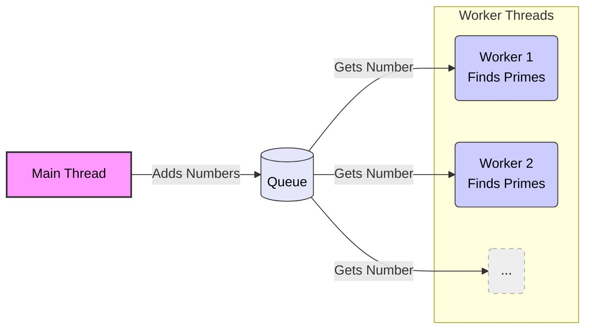

# Assignment 11: C# Finding Primes

## Overview

This assignment is your first C# program in this course.  You will be finding primes numbers in a range of numbers.  The goals of the assignment is to make sure you have the software (C# and IDE) installed on your computer and can you use threads to solve this problem to speed up the program.

Review the reading material to understand the software requirements of C#.

You only have 1 week to complete This assignment.

## Assignment

### Assignment files

You are given a working C# project that will display primes found within a range of numbers.  

### Requirements

In C#, implement the following structure in your program.  

- The main thread will add numbers to a queue.
- Each worker thread will take a number from the queue and check if it's a prime number.  If it's a prime number, the worker will display it.
- Create 10 workers.
- Make sure that any number displayed are not "mixed up" with other numbers.  The output of the program you are creating should have the same format of the program that is given to you.  (ie., 10000999577, 10000999583, 10000999597, ...).  Each value separated by a comma.
- Do not use Tasks for this assignment, only threads.
- At the end of the program, you will display the number of primes found.  It must be 43,427 primes.

## Rubric

- Make sure you follow the requirements.
- Your program needs to be much faster than the starting program we are giving you.

## Submission

- There are many files in a C# program, for this assignment, only submit `program.cs` to canvas.

